

# 🚲 AdventureWorks Data Warehousing
### B2C Internet Sales Analysis

---

## 📋 Project Overview
This project explores the Business-to-Customer (B2C) internet sales data within the **AdventureWorksDW** database. The primary goal is to extract actionable business insights regarding revenue trends, customer behavior, product profitability, and geographic performance. 

The analysis relies on advanced SQL techniques—including Window Functions, CTEs, and dynamic data bucketing—to create clean, aggregated datasets ready for visualization in BI tools like Tableau and Power BI.

> **Note:** Business-to-Business (B2B) Reseller sales are excluded from this specific analysis and will be evaluated in a separate project.

---

## 🔗 Quick Links
* 📊 **Tableau Dashboard:** [Explore the Interactive Dashboard Here](https://public.tableau.com/app/profile/vasif.asadov2730/viz/AdventureWorksExecutiveDashboard_17723260919680/Dashboard2)
* 📂 **GitHub Repository:** [Adventureworks B2C Analysis Code](https://github.com/vasif-asadov1/Adwentureworks-Bike-Sales-Analysis)
* 🗃️ **Data Source:** [AdventureWorksDW Database](https://github.com/Microsoft/sql-server-samples/releases/download/adventureworks/AdventureWorksDW2022.bak)
* 📖 **Documentation & Analysis:** [SQL Queries, Explanations and Analysis](https://vasif-asadov1.github.io/Adwentureworks-Bike-Sales-Analysis/)

---

## 🏗️ Project Structure
The analysis is structured from initial environment setup through 6 core analytical and modeling sections.

### Initial Setup: Environment Setup & Data Preparation
Before executing the B2C analysis, the database environment was configured and referential integrity was established to ensure accurate querying and seamless data modeling.

* **Database Restoration:** Executed T-SQL server-level commands to restore the `AdventureWorksDW` database from a raw `.bak` backup file into the SQL Server environment.
* **Referential Integrity Enforcement:** The default database schema lacked strict relational mappings. `ALTER TABLE` commands were used to establish the Star/Snowflake schema architecture by adding standard `FOREIGN KEY` constraints.
* **Hierarchy Mapping:** 
  * Connected Geographic dimensions (`DimGeography` to `DimSalesTerritory`).
  * Enforced the complete Product Hierarchy (`DimProduct` to `DimProductSubcategory` to `DimProductCategory`).
  * Resolved mapping for operational tables, bridging `FactInternetSalesReason` securely to both the sales fact table and the specific reason dimension table.

---

## 📈 Section 1: Executive Macro-Performance & Revenue Trends
Focuses on the high-level financial health of the B2C channel, utilizing CTEs and Window Functions to calculate growth and running totals.

**1. What is the overall Gross Profit and Gross Margin for the B2C channel, and how has it trended year over year?**

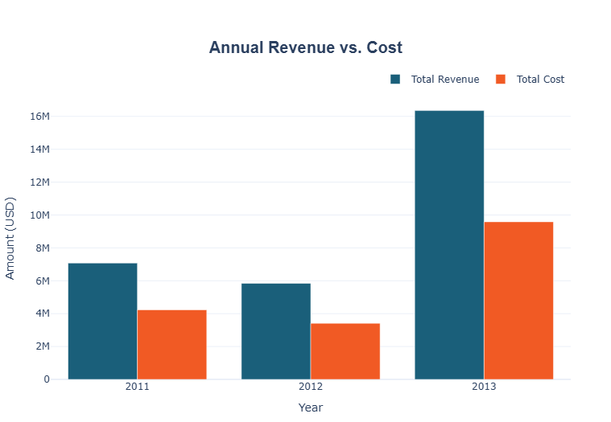

> The overall Gross Profit is roughly **\$12.1M**, maintaining a steady Gross Margin near **41.3%**. Year-over-year, profit initially dipped from ~\$2.9M in 2011 to ~\$2.4M in 2012 due to a noticeable drop in sales. However, 2013 saw a massive surge, with profit skyrocketing to **~\$6.8M**. Despite these revenue fluctuations, the margin remained incredibly stable.

**2. What is the Year-over-Year (YoY) revenue growth rate for each month?**

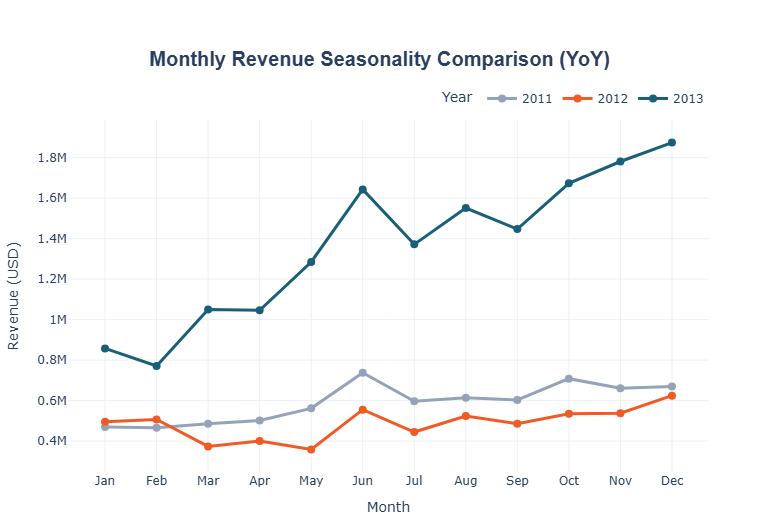

> Based on the visualization, the YoY monthly revenue growth reveals a stark contrast. In 2012, revenue lagged behind 2011, showing negative growth for almost every month. However, 2013 experienced explosive YoY growth across the board compared to 2012. Revenue more than doubled most months, starting strong in January and surging continuously to peak near **\$1.9M in December**.

**3. What is the monthly seasonality of our sales, and which quarter drives the most revenue historically?**

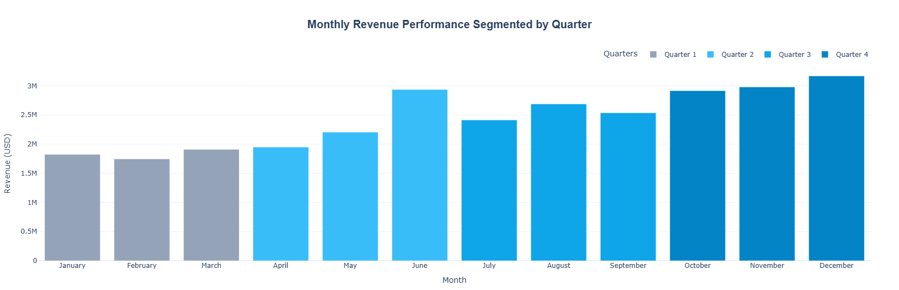

> The chart reveals a clear upward trend in monthly revenue as the year progresses. **Quarter 1** starts slow, with revenue hovering slightly below \$2M. Growth accelerates in **Quarter 2**, climaxing with a massive spike to nearly \$3M in June. While **Quarter 3** dips to stabilize around \$2.5M, **Quarter 4** drives a strong finish, peaking in December at the year's absolute highest point, exceeding **\$3M**.

**4. What is the Average Order Value (AOV) for the B2C channel, and how has it trended over time?**

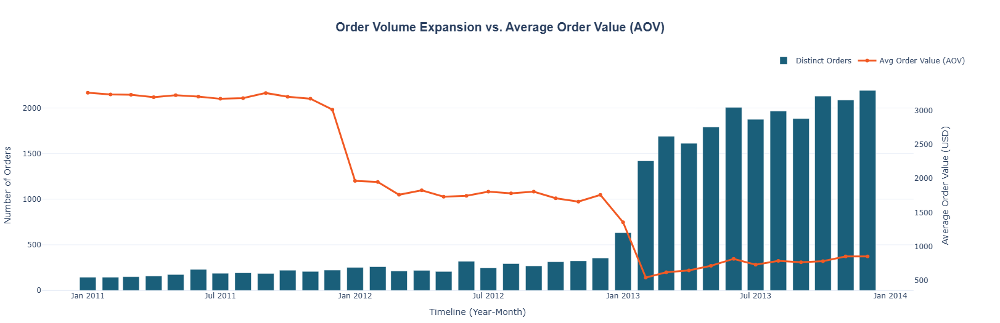

> The Average Order Value (AOV) shows a stark downward trend over time, inversely mirroring a massive expansion in order volume. In 2011, AOV held steady near its peak of over **\$3,000**, while monthly order volume remained below 250. However, AOV dropped sharply in early 2012 to around **\$1,800**, and plummeted again in early 2013 to stabilize between **\$500 and \$800**, even as monthly orders exploded past 2,000.

**5. What is the Year-to-Date (YTD) revenue and profitability for the current year compared to the previous year?**

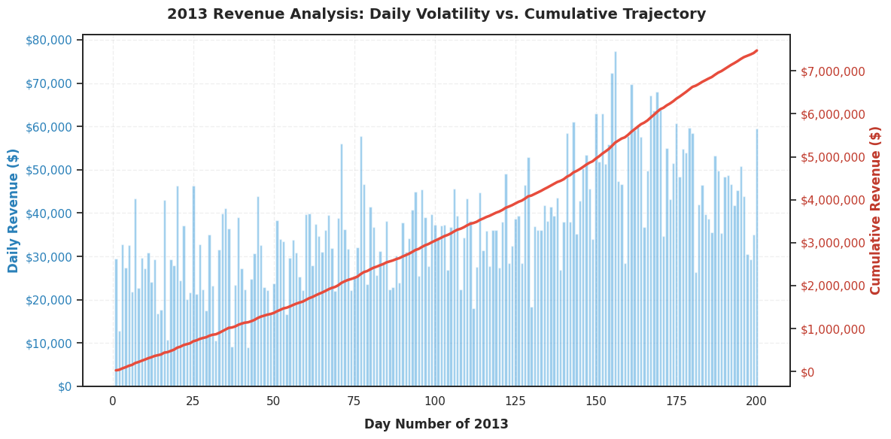

> The 2013 cumulative revenue trajectory shows remarkably steady growth, climbing consistently over the first 200 days to reach approximately **\$7.5M**. Daily revenue demonstrates high volatility, generally fluctuating between \$20k and \$50k with occasional spikes peaking near \$77k around day 156. This steady cumulative slope indicates that despite sharp daily variations, the underlying demand and incoming cash flow remained highly stable and predictable throughout the period.

**6. Which demographic segments (based on Income and Education) drive the highest overall revenue?**

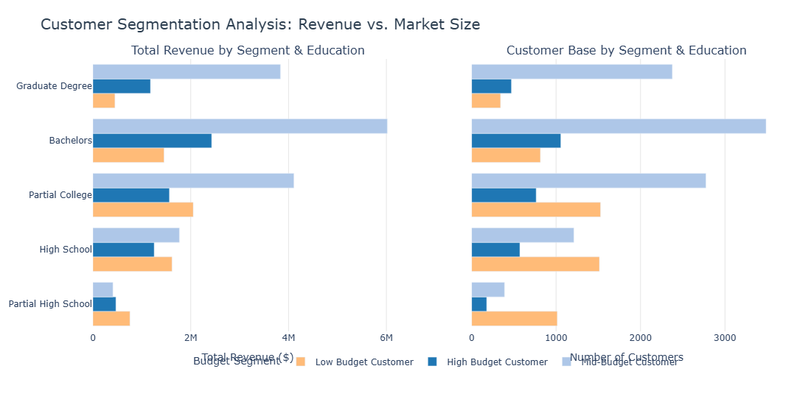

> The highest revenue is overwhelmingly driven by the **Mid-Budget segment with a Bachelors degree**, generating approximately **\$6M**. Mid-Budget customers consistently lead across higher education tiers, with Partial College and Graduate Degrees following near \$4M. Conversely, Low and High Budget segments yield significantly lower returns across all education levels, rarely exceeding \$2.5M.

**7. Does the customer's commute distance and vehicle ownership impact their lifetime value?**

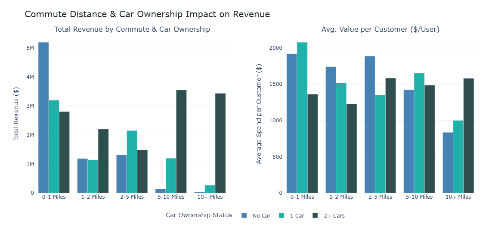

> **Short-distance commuters (0-1 miles)** with no cars drive the highest overall revenue, topping **\$5M**, while those with one car hold the highest average spend in that bracket. Conversely, as commute distances exceed 5 miles, revenue generation shifts dramatically to households with 2+ cars. This multi-car segment dominates both total revenue and average spend per customer for all long-distance commutes.

**8. What is our generational spend distribution (Age Brackets)?**

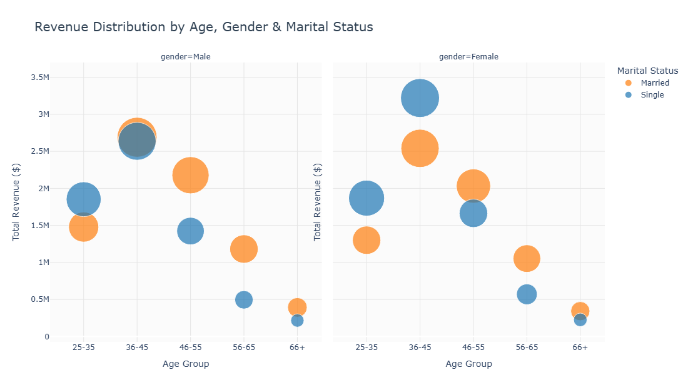

> Revenue peaks sharply in the **36-45 age bracket**, led overwhelmingly by single females generating over **\$3M**. A distinct shift in marital status occurs with age: single individuals drive more revenue in the younger 25-35 group, but for all cohorts 46 and older, married customers consistently outspend singles across both genders. Overall revenue steadily declines as customers age past 45.

**9. Which product categories and subcategories drive the highest profit margins, and which are a drag on profitability?**

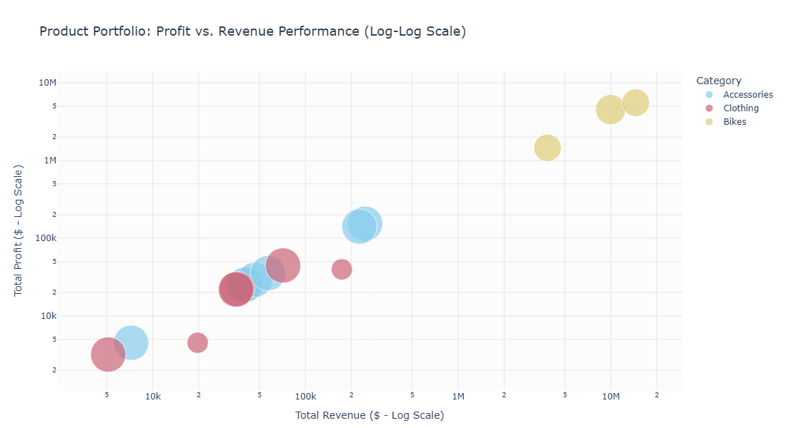

> **Bikes** are the undisputed powerhouse of the portfolio, clustered in the top-right quadrant with revenues exceeding \$2M and profits topping \$1M. In stark contrast, Accessories and Clothing generate significantly lower returns, generally yielding under \$200k in both metrics. Despite these vast differences in scale, all categories maintain a tight, positive correlation between revenue and profitability.

**10. What is the disparity between our "High Volume" products and our "High Value" products?**

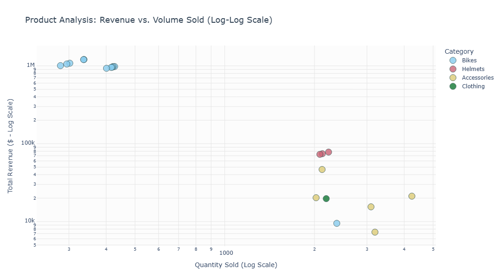

> The log-log scatter plot highlights a massive divide in product performance based on volume and price point. **Bikes** dominate the revenue generation, clustering tightly at the top left of the chart. They achieve near \$1M in revenue despite very low sales volumes, indicating they are high-ticket items.
> 
> In contrast, **Accessories and Helmets** follow a high-volume, lower-return model. Accessories push the highest quantities sold—ranging from 2,000 to over 4,000 units—yet they languish at the bottom of the revenue scale, mostly failing to break \$50k. Ultimately, the business relies heavily on low-volume bike sales for top-line revenue, while accessories drive pure transaction volume.

**11. What is our basket size distribution, and how frequently do customers buy multiple items in a single transaction?**

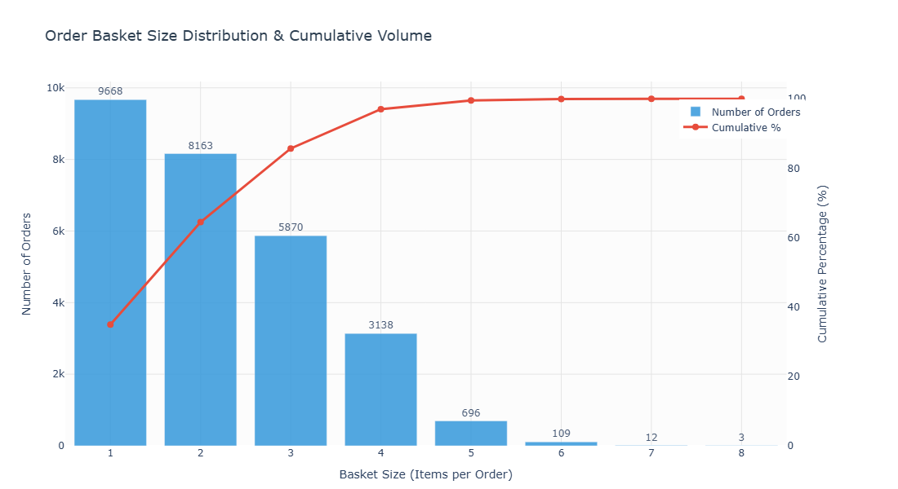

> **Single-item baskets dominate** the sales landscape, leading the pack with 9,668 distinct orders. The frequency of purchases drops steadily as basket size grows, though 2-item (8,163) and 3-item (5,870) baskets still move significant volume. The cumulative percentage line reveals that orders containing three items or fewer drive over 80% of the entire order volume. Large bulk purchases are practically nonexistent; baskets containing six to eight items represent a microscopic fraction of the overall business.

**12. What are the primary psychological drivers (Sales Reasons) behind our B2C purchases?**

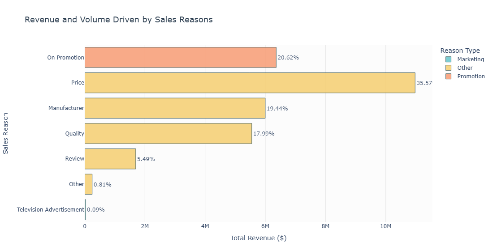

> **Price** stands out as the dominant driving factor for sales, generating the highest total revenue at nearly **\$11M** and accounting for over 35% of the total volume. The "On Promotion" reason follows as the second most impactful driver, pulling in roughly \$6.4M. Brand reputation and product build also play massive roles, with "Manufacturer" and "Quality" reasons contributing firmly around the \$5.5M to \$6M mark.
> 
> In stark contrast, direct marketing efforts appear completely ineffective for this channel. Television Advertisements account for a microscopic 0.09% of revenue. Customers are clearly motivated by out-of-pocket costs, promotions, and inherent product value rather than traditional advertising campaigns.

**13. What is our Customer Lifetime Value (CLV) distribution, and how long does it take for a customer to reach their maximum value?**

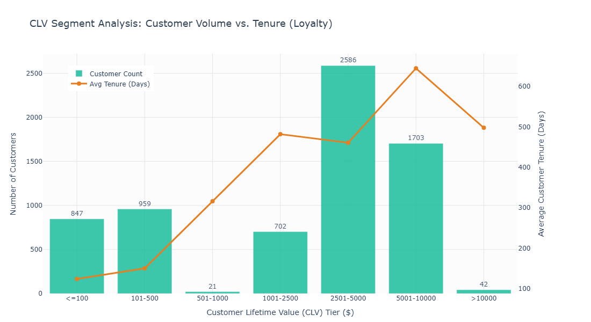

> The customer base is heavily concentrated in the mid-to-high CLV tiers, with the largest segment (2,586 customers) landing directly in the **\$2,501–\$5,000** range. Curiously, there is a massive drop-off in the \$501–\$1,000 tier, suggesting that buyers either churn early at lower dollar amounts or stick around to become high-value, long-term shoppers.
> 
> Customer tenure strongly correlates with overall value. Reaching the peak loyalty tier of \$5,001–\$10,000 requires the longest retention, with these customers averaging around **640 days** (nearly two years) of engagement to maximize their lifetime value.

**14. Which countries and regions drive the most B2C revenue, and how does the Average Order Value (AOV) differ geographically?**

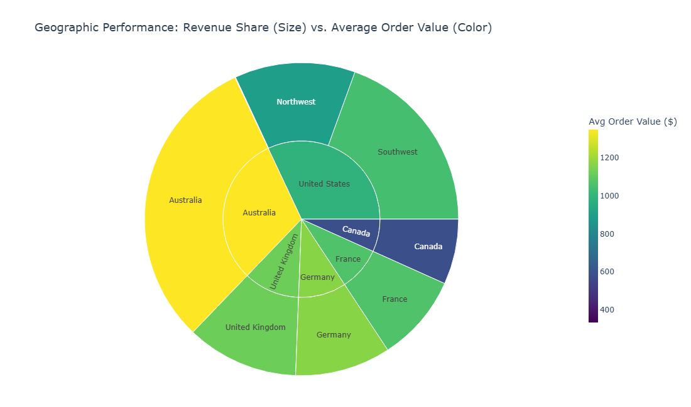

> **Australia and the United States** are the undisputed powerhouses for B2C revenue. Australia represents the single most lucrative market, leading globally in Average Order Value (AOV) with a peak exceeding **\$1,300**.
> 
> In contrast, the United States displays regional variation; the Southwest region maintains a strong AOV of around \$1,000, but the Northwest lags behind with roughly \$850. European markets like Germany and the UK show healthy mid-to-high AOVs between \$1,000 and \$1,150. Meanwhile, **Canada** occupies the smallest market share and records the lowest overall AOV, bottoming out near **\$500**.

**15. Is there a regional bias for specific Product Categories?**

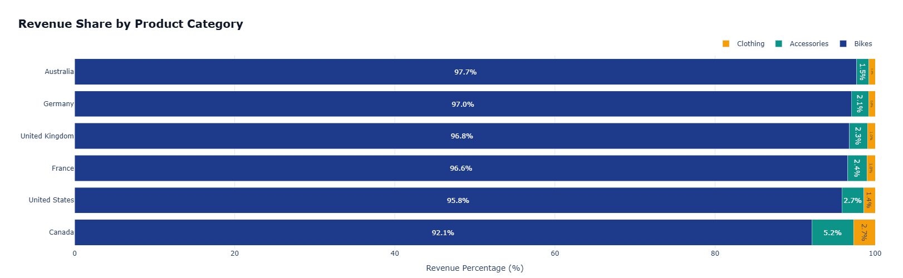

> There is virtually no regional bias when it comes to product categories. **Bikes universally dominate** revenue share across every single country. In top-performing markets like Australia, Germany, and the UK, Bikes account for a staggering **97% to almost 98%** of all revenue. The only slight outlier is Canada, where the reliance on Bikes dips just a bit to 92.1%, giving Accessories (5.2%) and Clothing (2.7%) a marginally larger slice of the pie.

---

## 📊 Tableau Dashboard

Tableau was used to create an interactive dashboard that visualizes the key insights derived from the SQL analysis. The dashboard allows users to explore revenue trends, customer demographics, product performance, and geographic distribution in a dynamic and user-friendly manner. I imported the star schema into the Tableau environment and connected the visualizations to the underlying SQL queries to ensure real-time data accuracy.

**1. Age & Gender Distribution of Customers**
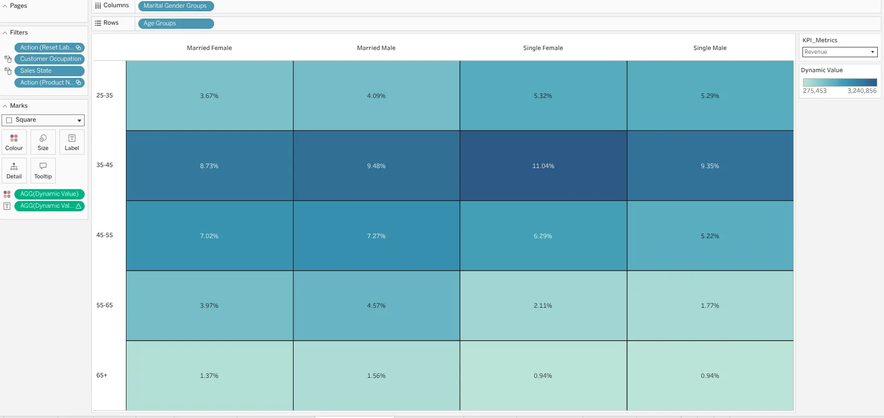

**2. Countries by Revenue**
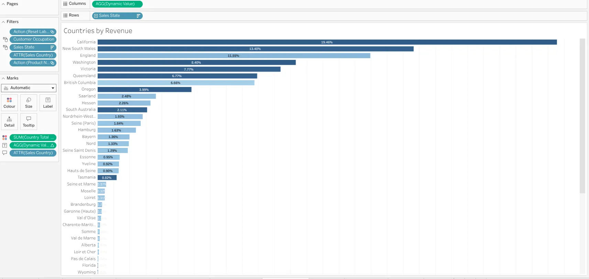

**3. Education & Occupation Segmentation**
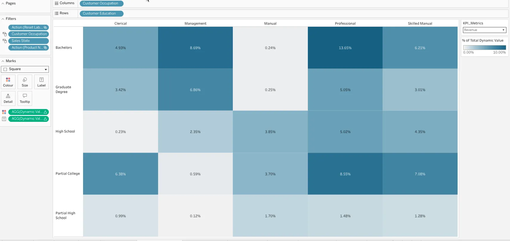

**4. Pareto Analysis of Product Categories**
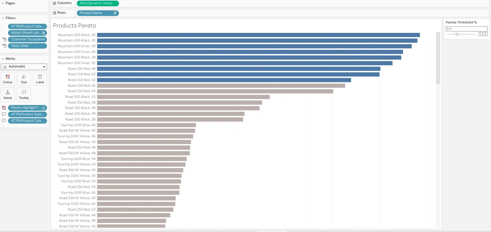

**5. Sales Dashboard with Filters**
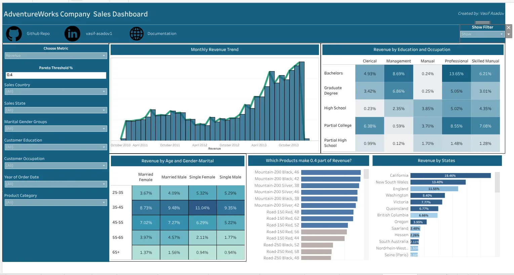

**6. Sales Dashboard without Filters**
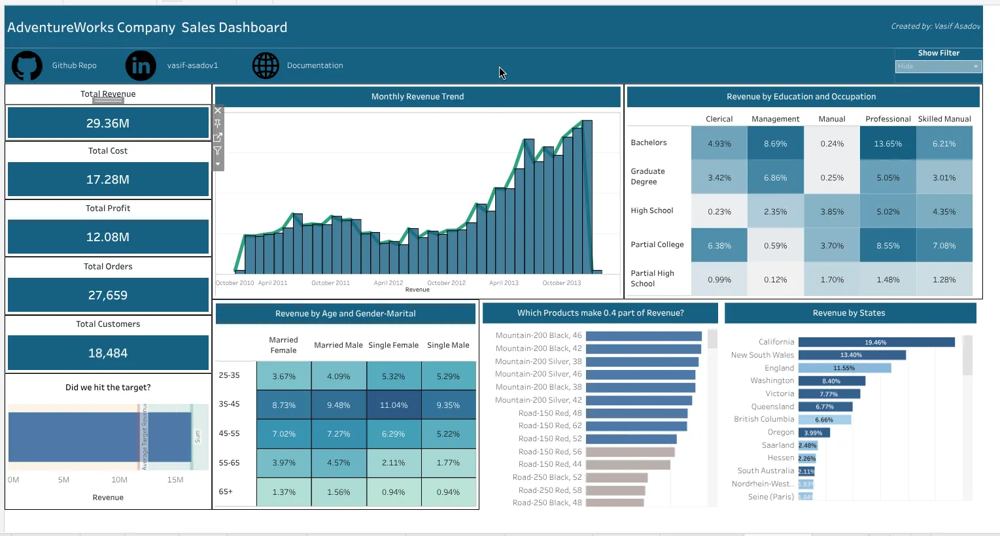

---

  
*Created by [Vasif Asadov](https://github.com/vasif-asadov1)*

